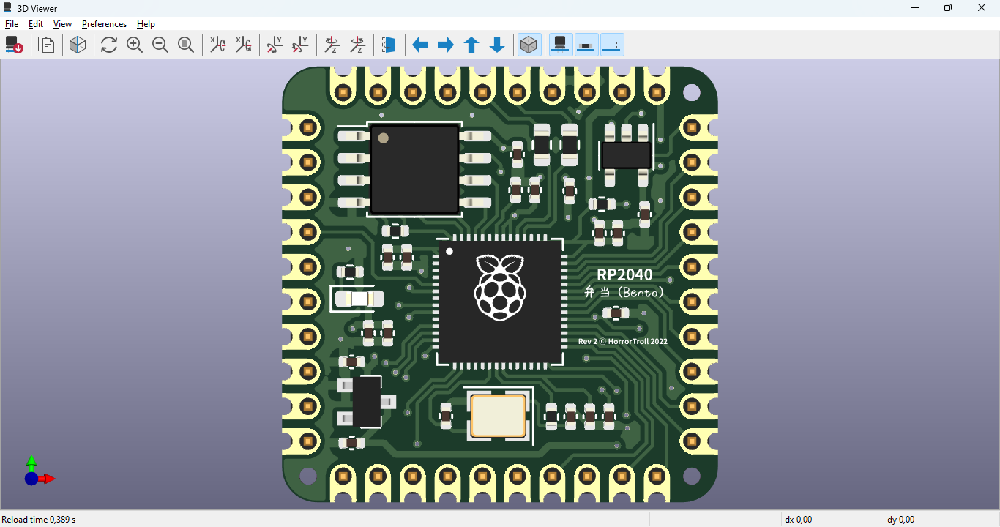

# RP2040-Bento

The RP2040-bento is a breakout board for the RP2040 MCU.

The board doesn't have onboard USB port so the USB port should be designed into the carrier board.

The Fabrication files are available, these files has been tested with jlcpcb service with greate success.

This is still in development, though initial testing has been done, the design is still not in its final shape, please consider carefully before ordering from JLCPCB. You might need to do some debugging if problems arise.
